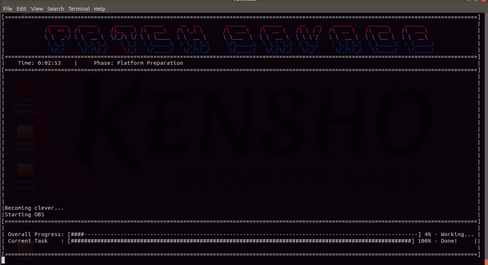

# Terminal Preroll Animation in Python


`terminal-preroll` is a small, configurable python module for displaying a visually-pleasing, simplistic terminal animation in the style of a "loading screen", intended for use with small games or as a pre-roll animation for a livestream or video; thus the name. The script requires and accepts only three pieces of information:
- the location of a file telling it how to draw its banner;
- the location of a file telling it where to find text for the loading screen itself (the "hype" file), and;
- the amount of time, in minutes, you want it to last for.

The banner and hype files are simple json files, easily-edited, and the script itself handles sizing itself dynamically for your terminal window by use of the python package `blessings`, with colours provided by `termcolor`.

## How to install
If you're running python3 on most systems, you can install the package with the following command:

```shell script
pip3 install terminal-preroll
```

You will also need to either download (from this repo) or create a banner file and hype file.

## How to run
Assuming you have your banner and hype files, you can run the script very easily from the command line:

```shell script
python3 -m terminal-preroll -t 15 -b banner.json -s hype.json
```

Where:
- `-t` is an argument giving the time-to-run in minutes
- `-b` is an argument giving the path to the banner object
- `-s` is an argument giving the path to the hype object.

### Modifying the Banner Object
The banner file is a json object, of the rough structure below:
- a "banner_strings" attribute, itself an array of strings, each representing one line of the banner.
- a "line_colors" attribute, an array of strings giving a valid terminal color to each line. If there are less entries in this array than lines in banner_strings, the default terminal colour is used.

**Note:** Much like python, the json standard requires two particular characters be "escaped" by adding an extra `\` before them in the strings in banner_strings. This is important if you are using ASCII art, such as in the example below. In your ASCII art, replace `\` with `\\` and `"` with `\"` to account for this.

### Modifying the Hype Object
The hype object is very simple - it's just an object of arrays. The "name" of each array is used as the value of `phase` as in the example screenshot, while the strings in each phase's array are scrolled on the bottom as they "complete".

The script uses the total number of lines in this object and the time the animation is expected to last to determine how often to scroll the screen and how quickly to update the "current item" loading bar.